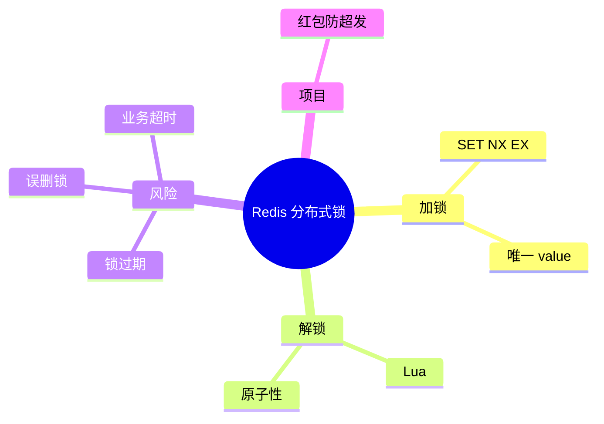

# 06 - Knowledge System

## 1. 目标

Knowledge System 负责把用户学习过的内容转为可长期复习、可检索、可展示、可追问的知识资产。

## 2. 一个知识点的多种形态

同一个知识点应支持：

1. Markdown Note
2. Knowledge Card
3. MindMap
4. Flash Card
5. Interview Answer
6. Follow-up Questions
7. Project Connection

## 3. Knowledge Card 格式

```json
{
  "title": "Redis 分布式锁",
  "one_sentence": "用 SET NX EX 加唯一 value 实现加锁，用 Lua 判断 value 后删除锁。",
  "core_principle": "SET NX 保证互斥，EX 防止死锁，唯一 value 防止误删，Lua 保证释放锁原子性。",
  "interview_answer": "...",
  "common_followups": ["锁过期怎么办？", "为什么要 Lua？", "RedLock 是否可靠？"],
  "project_connection": "红包领取场景防止超发",
  "mastery_score": 70
}
```

## 4. Markdown Note

Markdown 适合深度阅读。

结构：

```markdown
# Redis 分布式锁

## 一句话结论
## 面试官想考什么
## 核心原理
## 代码示例
## 常见追问
## 项目结合
## 易错点
## 面试背诵版
```

## 5. MindMap

MVP 可用 Mermaid：



## 6. Flash Card

用于复习。

示例：

```json
{
  "front": "为什么 Redis 分布式锁释放锁要用 Lua？",
  "back": "因为需要保证判断锁归属和删除锁两个动作的原子性，避免误删别人的锁。"
}
```

## 7. 知识掌握度

掌握度来自：

- 用户自评
- 模拟面试评分
- 追问表现
- 复习间隔
- 是否能结合项目

建议范围：0 - 100。
