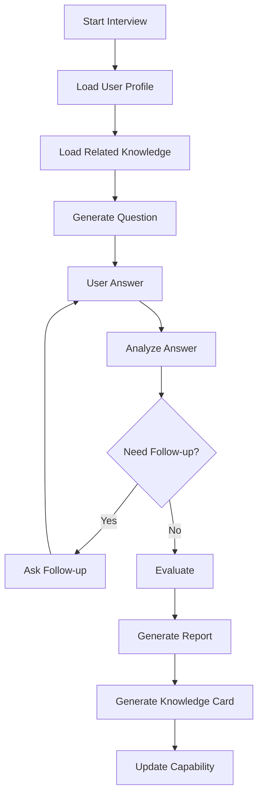

# Interview Workflow

```mermaid
flowchart TD
    A[Start Interview] --> B[Load User Profile]
    B --> C[Load Related Knowledge]
    C --> D[Generate Question]
    D --> E[User Answer]
    E --> F[Analyze Answer]
    F --> G{Need Follow-up?}
    G -->|Yes| H[Ask Follow-up]
    H --> E
    G -->|No| I[Evaluate]
    I --> J[Generate Report]
    J --> K[Generate Knowledge Card]
    K --> L[Update Capability]
```
