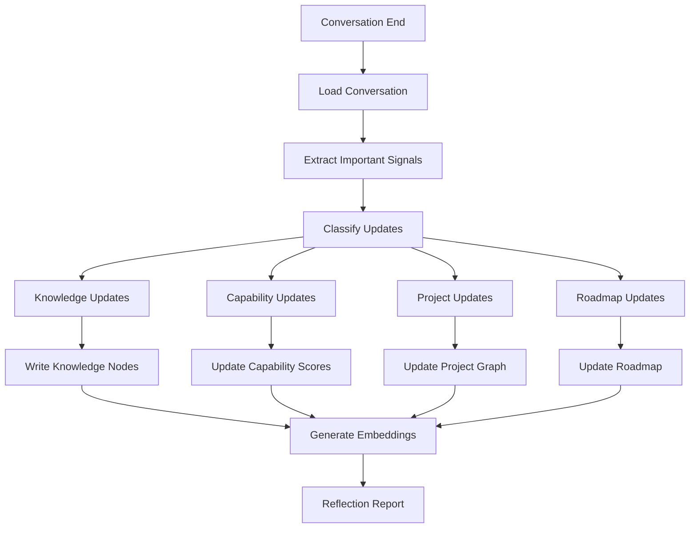

# Reflection Workflow

```mermaid
flowchart TD
    A[Conversation End] --> B[Load Conversation]
    B --> C[Extract Important Signals]
    C --> D[Classify Updates]
    D --> E[Knowledge Updates]
    D --> F[Capability Updates]
    D --> G[Project Updates]
    D --> H[Roadmap Updates]
    E --> I[Write Knowledge Nodes]
    F --> J[Update Capability Scores]
    G --> K[Update Project Graph]
    H --> L[Update Roadmap]
    I --> M[Generate Embeddings]
    J --> M
    K --> M
    L --> M
    M --> N[Reflection Report]
```
